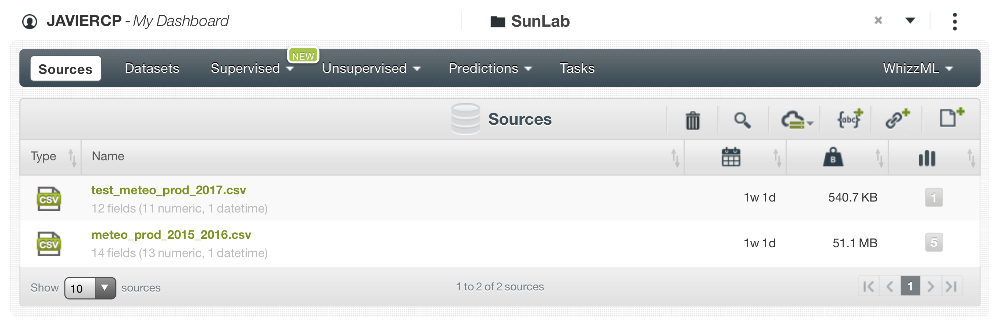
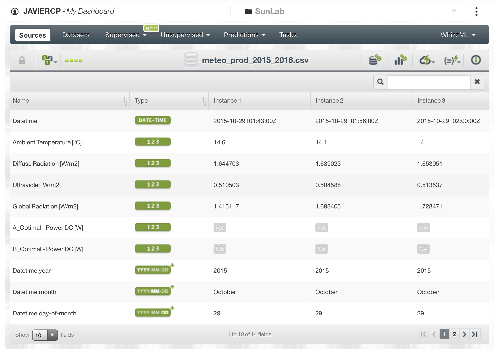
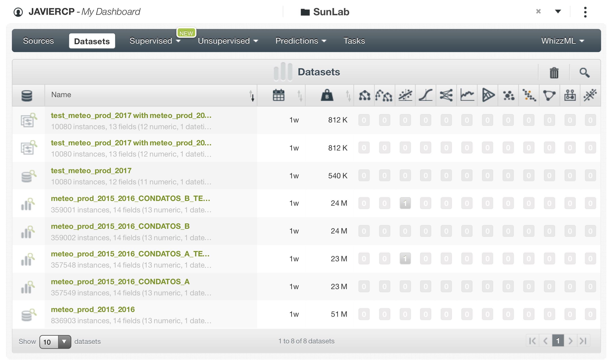
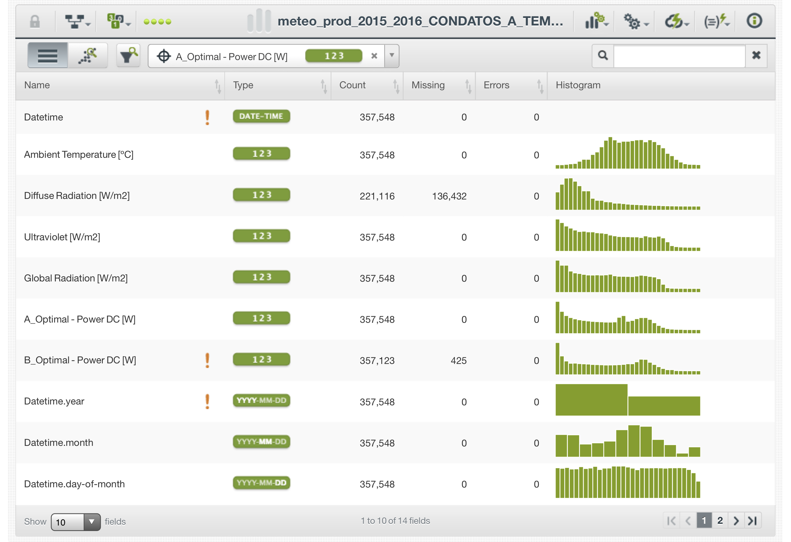
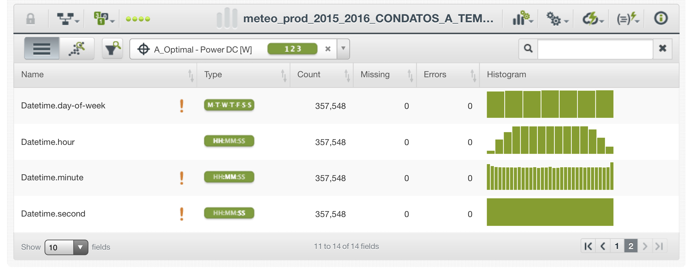
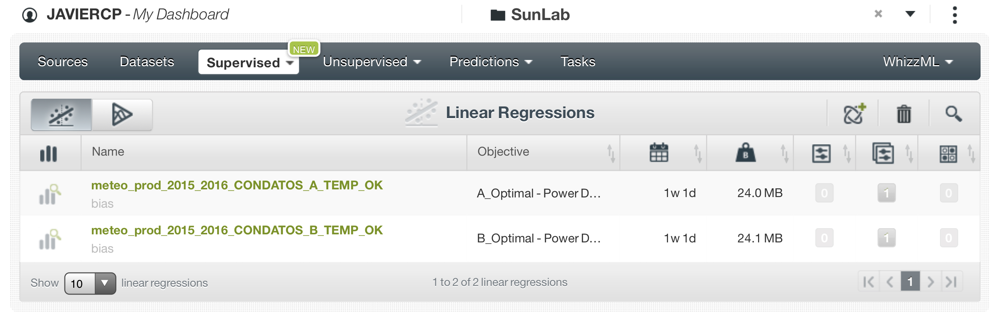
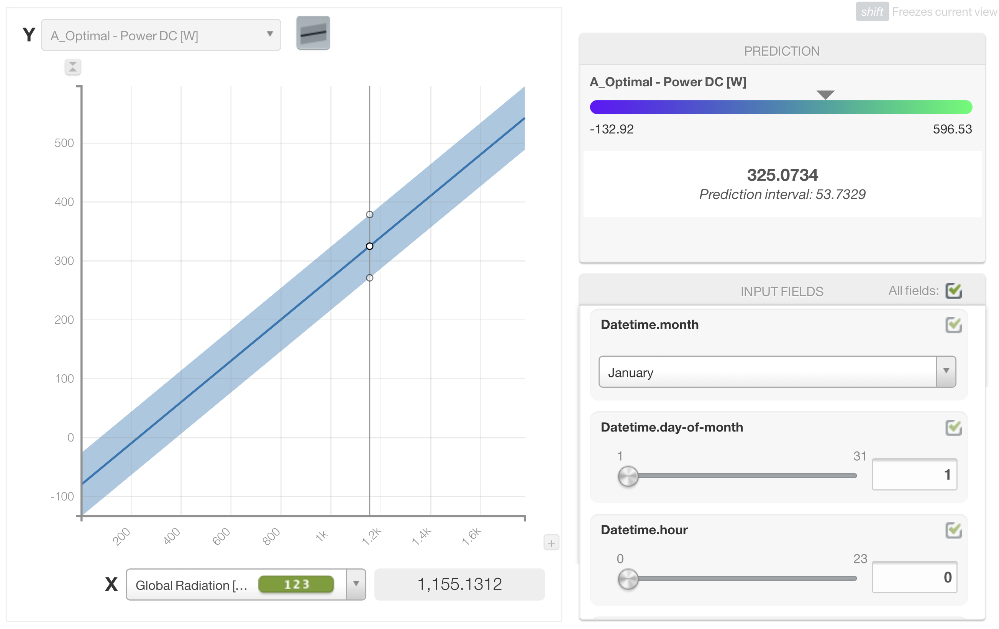
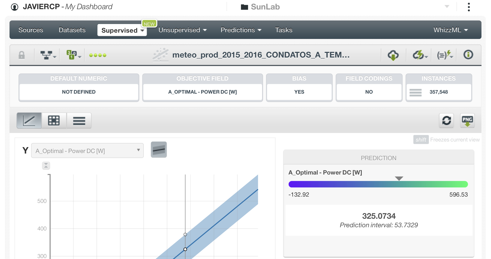
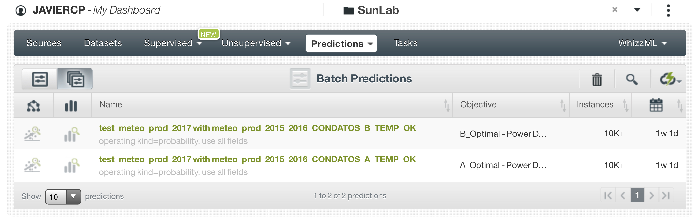
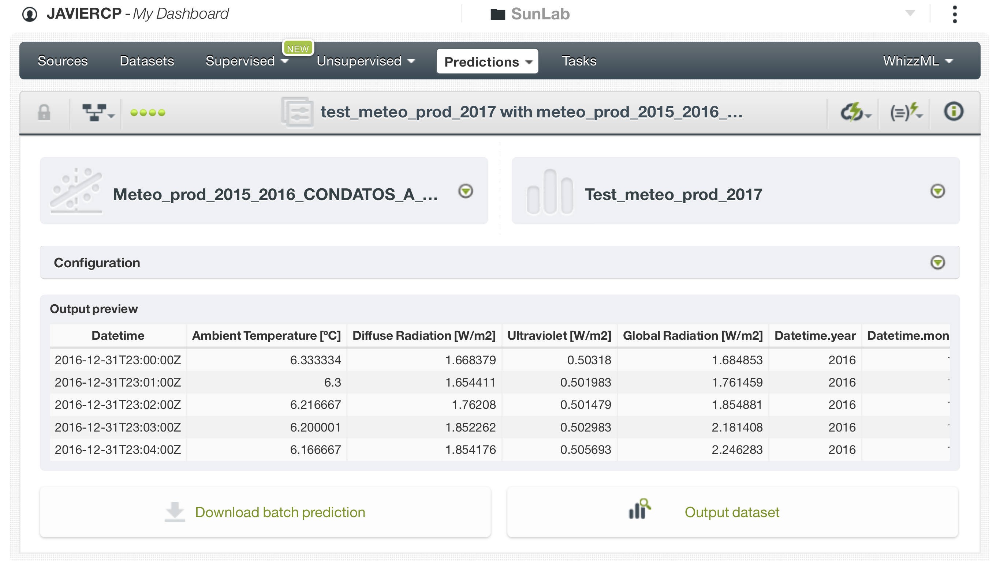

# Solución reto día del Hackathon.

En este apartado está descrito cómo nuestro equipo solucionó este reto durante el Hackathon. Se han añadido comentarios para dar más claridad al desarrollo. Aparte de estas notas no hemos añadido nada sustancial al análisis que no fuese incluido durante la competición.  

Para ver un análisis hecho con más tiempo y más cercano a lo que nos hubiese gustado hacer puedes pasar directamente al apartado 3 de este notebook.

## Carga de las librerias necesarias.

```{r , warning= FALSE, message= FALSE}
library(tidyverse)
library(readxl)
library(VIM)
library(GGally)
```


## Preparación datos "train".

Los datasets originales de train estaban en formato 'xls' y al abrirlos daban un error de formato. No pudimos importarlos en R directamente, ya que nos daba un error con la importación también. Así que los guardamos como 'csv' para posteriormente importarlos en R. En este proceso también tuvimos algún problema, así que la importación de los datos nos llevó mucho más tiempo de lo esperado. 

Archivos originales "train": 


'sunlab-faro_meteo_2015.xls'  
'sunlab-faro_meteo_2016.xls'  
'sunlab-faro-pv-2015.xls'  
'sunlab-faro-pv-2016.xls'  

Importamos los archivos ya convertidos a formato 'csv'. 
```{r , warning= FALSE, message= FALSE}
meteo_2015 <- read_csv("./data/hackathon_data/train/sunlab-faro_meteo_2015.csv")
meteo_2016 <- read_csv("./data/hackathon_data/train/sunlab-faro_meteo_2016.csv")
prod_2015 <- read_csv("./data/hackathon_data/train/sunlab-faro-pv-2015.csv")
prod_2016 <- read_csv("./data/hackathon_data/train/sunlab-faro-pv-2016.csv")
```


Unimos las parejas de archivos de datos de producción y meteorológicos. 
```{r , warning= FALSE, message= FALSE}
meteo_2015_2016 <- bind_rows(meteo_2015, meteo_2016)
prod_2015_2016 <- bind_rows(prod_2015, prod_2016)

# Borramos los archivos originales

rm(meteo_2015)
rm(meteo_2016)
rm(prod_2015)
rm(prod_2016)
```
Echamos un vistazo a los datos de producción con las funciones 'summary' y 'glimpse'.
```{r , warning= FALSE, message= FALSE}
summary(prod_2015_2016)
```


```{r , warning= FALSE, message= FALSE}
glimpse(prod_2015_2016)
```
Y aquí directamente ya decidimos quedarnos directamente con las variables target a predecir 'A_Optimal - Power DC [W]' y 'B_Optimal - Power DC [W]') más la variable 'Datetime' que nos servirá para cruzar esta tabla con la tabla de datos meteorológicos.
```{r , warning= FALSE, message= FALSE}
prod_2015_2016_final <- prod_2015_2016 %>%
                        select(Datetime, 
                               'A_Optimal - Power DC [W]',
                               'B_Optimal - Power DC [W]')
```

Vemos los principales estadísticos de las variables de la tabla de datos meteorológicos.
```{r , warning= FALSE, message= FALSE}
summary(meteo_2015_2016)
```

Y decidimos quedarnos únicamente con 4 variables más la variable 'Datetime', que nos servirá de referencia para el cruce con la tabla anterior.
```{r , warning= FALSE, message= FALSE}
meteo_2015_2016_final <- meteo_2015_2016 %>%
                        select(Datetime, 
                               'Ambient Temperature [ºC]',
                               'Diffuse Radiation [W/m2]',
                               'Ultraviolet [W/m2]',
                               'Global Radiation [W/m2]')
```


Cruzamos las tablas por Datetime y comprobamos que no se duplican registros, ya que la tabla final tiene el mismo número de registros que la tabla de producción: 420.507.
```{r , warning= FALSE, message= FALSE}
tabla_final <- prod_2015_2016_final %>%
  left_join(meteo_2015_2016_final, by = 'Datetime')
```

Inspeccionamos las variables.
```{r , warning= FALSE, message= FALSE}
summary(tabla_final) 
```

Aquí vemos que la variable `Ambient Temperature [ºC]` tiene como dato mínimo un posible error. Así que filtramos esta variable para corregirlo.

```{r , warning= FALSE, message= FALSE}
tabla_final <- tabla_final %>% 
                filter(`Ambient Temperature [ºC]` > -100)
```

Comprobamos que hemos resuelto el problema.
```{r , warning= FALSE, message= FALSE}
summary(tabla_final$`Ambient Temperature [ºC]`)
```

Y exportamos el archivo final en formato csv para cargarlo en la herramienta de modelización BigML.
```{r , warning= FALSE, message= FALSE}
write_csv(tabla_final, "meteo_prod_2015_2016.csv")
```


## Preparación datos "test".

Importaciones
```{r , warning= FALSE, message= FALSE}

test_prod_2017 <- read_csv("./data/hackathon_data/test/test-sunlab-pv-2017.csv")
test_meteo_2017 <- read_csv("./data/hackathon_data/test/test-sunlab-meteo-2017.csv")

```

Cruzamos las tablas por Datetime
```{r , warning= FALSE, message= FALSE}
tabla_final_test <- test_prod_2017 %>%
              left_join(test_meteo_2017, by = "Datetime") %>%
                        select(`A_Optimal - Power DC [W]`, 
                               `Global Radiation [W/m2]`,
                               `Ultraviolet [W/m2]`)
```


Exportamos el archivo final en formato csv para cargarlo en la herramienta de modelización BigML.
```{r , warning= FALSE, message= FALSE}          
write_csv(tabla_final_test, "test_meteo_prod_2017.csv")
```


## Modelo base panel A

Una vez creadas y exportadas la tablas para crear los modelos en BigML y mientras se ejecutan los modelos en esa plataforma creamos un modelo base (o de partida) en R para el tipo de panel A.

Creamos un modelo con una regresión lineal para predecir los valores de Power DC [W] en función de dos únicas variables `Global Radiation [W/m2]` y `Ultraviolet [W/m2]`
```{r , warning= FALSE, message= FALSE}
# Eliminamos los registros del panel tipo B y eliminamos también los registros con NAs
tabla_final_A <- tabla_final %>% 
               select(-`B_Optimal - Power DC [W]`) %>%
                na.omit()

# Y creamos el modelo
modelo_A_1=lm(`A_Optimal - Power DC [W]` ~ `Global Radiation [W/m2]` + `Ultraviolet [W/m2]` , data =  tabla_final_A)

```

Inspeccionamos el modelo creado.
```{r , warning= FALSE, message= FALSE}
modelo_A_1

```
Obtenemos el resumen del mismo.
```{r , warning= FALSE, message= FALSE}

summary(modelo_A_1)

```
Y obtenemos un modelo base significativo (p-value mucho menor que 0,05) y con un R cuadrado ajustado de 0,83. Bastante bien para empezar. 

Extraemos del modelo los valores predecidos y seleccionamos también de la tabla los valores reales para posteriormente obtener los errores y el MAE (Mean Absolute Error).
```{r , warning= FALSE, message= FALSE}

fitted_values <- modelo_A_1$fitted.values
real_values <- tabla_final_A$`A_Optimal - Power DC [W]`
```

Obtenemos el MAE para tenerlo como referencia de comparación con los modelos que estamos desarrollando en BigML.
```{r , warning= FALSE, message= FALSE}

real_values_df <- as.data.frame(real_values)
fitted_values_df <- as.data.frame(fitted_values)


real_vs_fitted <- bind_cols(real_values_df, fitted_values_df)

errors <- real_vs_fitted %>% 
          mutate(abs_error = abs(fitted_values - real_values))

MAE <- mean(errors$abs_error)
MAE
```

El MAE que tendremos como referencia a mejorar es 22,54.

Para hacer la predicción para los 7 primeros días de 2017 seleccionamos de la tabla de test los campos utilizados en el modelo.
```{r , warning= FALSE, message= FALSE}
tabla_final_test_A <- tabla_final_test %>%
                        select(`A_Optimal - Power DC [W]`, 
                               `Global Radiation [W/m2]`,
                               `Ultraviolet [W/m2]`)
```

Hacemos la prediccion para los paneles A con nuestro modelo.
```{r }
prediccion_test <- predict(modelo_A_1, tabla_final_test_A)
```

Y exportamos nuestras predicciones para enviarlas también, junto a las obtenidas con BigML, al jurado del Hackathon.
```{r , warning= FALSE, message= FALSE}
prediccion_test <- as.data.frame(prediccion_test)
write_csv(prediccion_test, "predicciones_panel_A.csv")
```

El modelo base para los datos del tipo de panel B no nos dio tiempo a hacerlo.


## Modelización en BigML

Aquí se ven las fuente de datos creadas para este reto. "meteo_prod_2015_2016.csv" es la fuente a partir de los datos procesados en R para el 
entrenamiento del modelo. Y "test_meteo_prod_2017.csv" es la fuente, también procesada en R, con los datos para hacer la predicción.



Detalle de la fuente con las columnas que dejamos despues de procesar en R.


Aquí se ven los datasets que creamos a partir de las dos fuentes. Se puede ver que creamos un dataset a partir de los datos originales de 
la fuente "meteo_prod_2015_2016" y sobre él fuimos iterando. Primero lo dividimos en dos datasets, uno para los paneles de tipo A 
("meteo_prod_2015_2016_CONDATOS_A") y otro para los paneles de tipo B ("meteo_prod_2015_2016_CONDATOS_B"). Y luego eliminamos un valor de 
temperatura que era erroneo y nos descuadraba el resultado.
También está el dataset "test_meteo_prod_2017" que creamos a partir de los datos de test para hacer luego la predicción con el modelo.


Detalle de uno de los datasets con los campos que eliminamos para que no influyesen en la predicción.


Detalle de uno de los datasets con los campos que eliminamos para que no influyesen en la predicción.


Regresiones lineales creadas a partir de los datasets, una para cada modelo de panel solar.


Detalle de la grafica de predicción de una de las regresiones en función de la radiación.


Detalle de regresiones para uno de los paneles.


Predicciones batch para cada modelo creadas con el dataset de prueba.


Detalle de una de las predicciones.


Con las prisas y la falta de experiencia con la herramienta BigML no nos dio tiempo tampoco a comprobar la bondad del ajuste y calidad de los modelos generados. Nos dio el tiempo justo para simplemente enviar las predicciones de los primeros modelos que obtuvimos.  
